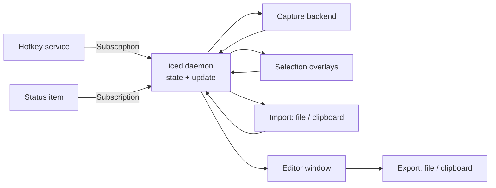

# Chartreuse

Chartreuse is a cross-platform screenshot and annotation tool. It runs quietly in the
background, springs to life on a global hotkey, lets the user pick exactly what to
capture, and hands the result to a lightweight editor for annotation before saving it
or putting it on the clipboard.

## Goals

- **Fast path from intent to image.** One hotkey, one gesture, and the capture is in
  the editor. No dialogs in the way.
- **Resident, not intrusive.** The program lives in the menu bar / system tray with no
  foreground window until the user asks for one.
- **Native-quality captures.** Images are captured at the display's physical pixel
  resolution, correctly handling multiple monitors with mixed scale factors.
- **Simple, non-destructive annotation.** Annotations are kept as editable objects on
  top of the captured image until the user exports.
- **Cross-platform.** macOS is the primary and mandatory platform. Windows and Linux
  (X11 and Wayland) are supported targets, with platform limitations documented rather
  than hidden.

## Non-goals (for now)

- Screen recording / video capture.
- Cloud upload or sharing integrations.
- A general-purpose image editor. Annotation tools stay focused on explaining a
  screenshot, not retouching it.

## Technology

- **Language:** Rust.
- **GUI:** [iced](https://github.com/iced-rs/iced). Relevant capabilities:
  - `iced::daemon` — the application runs with zero windows and opens/closes windows on
    demand, which matches a tray-resident program.
  - `Subscription` / `Task` — a uniform way to feed external events (global hotkeys,
    tray menu actions, async portal responses) into the application's update loop.
  - `Canvas` — custom drawing and hit-testing for the selection overlays and the
    annotation editor.
  - `cosmic-text` based text rendering — proper shaping, bidirectional text, and system
    font fallback for text annotations.
  - Access to native window handles — required to apply platform-specific window
    behavior (window levels, Spaces behavior, layer-shell) that iced does not expose.
- **Build automation:** a `cargo xtask` command kept in this repository is the single
  entry point for checks, bundling, signing, and releases. See
  [Build system](#build-system).
- **Platform integration:** thin, per-platform modules behind a common set of traits
  (see [Architecture](#architecture)). Crate choices for small concerns (clipboard, file
  dialogs, image encoding, etc.) are deferred until implementation.

## UI Elements

This section describes the elements the user interacts with, not their visual design,
apart from the accent color.

### Accent color

The UI uses a single accent color that identifies the build flavor at a glance:

| Build flavor | Accent color |
|---|---|
| Release | `#80ff00` |
| Development | `#f0cc00` |

The flavor is fixed at compile time and follows the same development/release distinction
as the bundle identifier (see [Identities](#identities)), not the Cargo optimization
profile. An optimized local build is still a development build.

### Status item (menu bar / tray icon)

- Indicates that Chartreuse is running while no window is open.
- Provides a menu with at least: each capture mode, open the image on the clipboard in
  the editor, open an image file in the editor, open settings, and quit.
- **Open from clipboard** reads the image currently on the clipboard. If the clipboard
  holds no image, the user is told so rather than the action silently doing nothing.
- **Open from file** shows the platform's open dialog, filtered to supported image
  formats. Files that cannot be decoded are reported to the user.
- The program has no Dock / taskbar presence while only the status item is showing.

### Global hotkeys

Three independently configurable hotkeys:

| Action | Behavior |
|---|---|
| **Capture display** | Captures all displays immediately and opens the result in the editor. |
| **Capture window** | Enters window-selection mode. |
| **Capture rectangle** | Enters rectangle-selection mode. |

Hotkeys are registered system-wide and work regardless of which application has focus.
Registration failures (e.g. a key combination already taken by another program) are
reported to the user.

### Rectangle-selection overlay

- A translucent overlay covers every display.
- The user presses, drags, and releases the pointer to define two diagonal corners; a
  box is drawn live during the drag to show the region that will be captured.
- The overlay shows a *frozen* image of the screen taken at the moment the hotkey was
  pressed, so transient content (menus, tooltips, hover states) can be captured.
- Escape cancels. Releasing the pointer commits the selection and opens the editor.
- Selections may span displays.

### Window-selection overlay

- A translucent overlay covers every display.
- The window under the pointer is left undimmed to indicate that clicking will capture
  it; the highlight follows the pointer as it moves between windows.
- Clicking captures that window. Escape cancels.

### Editor window

- Displays the image being annotated — a fresh capture, the clipboard image, or an
  opened file — with annotation tools. All three sources open the same editor.
- Initial tool set:
  - Line
  - Arrow
  - Rectangle
  - Ellipse
  - Freehand pen
  - Highlighter
  - Text
  - Numbered step markers
  - Blur / pixelate region
  - Crop
- Each annotation is an independent object: selectable, movable, restylable (color,
  stroke width, font size), and deletable.
- Undo / redo for all edits.
- Export actions: **save to file** and **copy to clipboard**. Either action may
  optionally close the editor.

### Settings

- Configure the three hotkeys.
- Default save location and filename pattern.
- Default post-capture behavior (e.g. open editor vs. copy directly to clipboard).
- Settings are persisted to a configuration file in the platform's standard config
  directory and can also be edited by hand.

## Architecture

### Components

- **App core** — the `iced::daemon` state machine. Owns configuration, the set of open
  windows, and the current capture session. All external events arrive as messages.
- **Hotkey service** — registers configured hotkeys with the OS and emits messages when
  they fire. Re-registers on configuration change.
- **Status item** — owns the menu bar / tray icon and its menu; emits messages for menu
  actions, including opening an image from the clipboard or a file.
- **Display model** — enumerates displays with their geometry in both logical and
  physical coordinates and their scale factors. All capture and overlay placement goes
  through this model so coordinate conversions live in one place.
- **Capture backend** — captures displays and individual windows, and enumerates
  on-screen windows (bounds, z-order, owner) for window-selection mode.
- **Overlays** — one borderless, top-most window per display, drawn with `Canvas`.
  Rectangle mode and window mode share this infrastructure.
- **Editor** — a document model (base image + ordered list of annotation objects + undo
  history) rendered with `Canvas`. Annotations are flattened into pixels only at export.
- **Import** — reads an image from the clipboard or decodes an image file into the
  editor's base image, bypassing capture.
- **Export** — encodes the flattened image and writes it to a file or the clipboard.

### Capture flow

1. A hotkey fires.
2. The capture backend immediately captures every display (and, for window mode, the
   current window list) at native resolution.
3. For *capture display*, go straight to the editor.
4. For rectangle or window mode, open an overlay window on each display showing the
   frozen capture.
5. On commit, crop the frozen capture to the selection (or capture the chosen window
   directly; see [Open questions](#open-questions)) and open the editor.

Capturing first and selecting second keeps behavior consistent across platforms and
fits the Wayland model, where the compositor hands the application a finished image.

Opening an image from the clipboard or a file skips capture and selection entirely: the
import component produces the base image and the editor opens directly.

## Platform APIs

### macOS (primary)

| Concern | API |
|---|---|
| Display & window capture | **ScreenCaptureKit** — `SCShareableContent` to enumerate displays and windows, `SCScreenshotManager` with `SCContentFilter` to capture a display or a single window. |
| Window enumeration for hit-testing | `SCShareableContent` window list; `CGWindowListCopyWindowInfo` for z-order and bounds if needed. |
| Screen Recording permission | TCC — `CGPreflightScreenCaptureAccess` / `CGRequestScreenCaptureAccess`. |
| Overlay windows | `NSWindow` level above the menu bar and Dock (e.g. `NSScreenSaverWindowLevel`); `NSWindowCollectionBehavior` (`canJoinAllSpaces`, `fullScreenAuxiliary`) so overlays appear over full-screen apps and on the active Space. |
| Background-only presence | `LSUIElement` in `Info.plist` / `NSApplicationActivationPolicyAccessory`. |
| Status item | `NSStatusBar` / `NSStatusItem`. |
| Global hotkeys | Carbon `RegisterEventHotKey` (does not require Accessibility permission). |
| Displays & scale | `NSScreen`, `CGDisplay*`. |
| Clipboard | `NSPasteboard`. |
| Open / save dialogs | `NSOpenPanel` / `NSSavePanel`. |

Notes:

- Screen Recording permission is tied to the app's code signature, so every build —
  including development builds — must be a signed `.app` bundle. See
  [macOS code signing](#macos-code-signing).
- Recent macOS versions periodically re-prompt the user to confirm Screen Recording
  access. The app must detect a revoked or missing permission and guide the user
  rather than silently producing blank captures.
- Distribution outside the Mac App Store requires a Developer ID signature and
  notarization.

### Windows

| Concern | API |
|---|---|
| Display capture | **Windows.Graphics.Capture** (`GraphicsCaptureItem` via `IGraphicsCaptureItemInterop::CreateForMonitor`); DXGI Desktop Duplication or GDI `BitBlt` as fallbacks. |
| Window capture | Windows.Graphics.Capture (`CreateForWindow`); `PrintWindow` as a fallback. |
| Window enumeration for hit-testing | `EnumWindows`, `WindowFromPoint`, `DwmGetWindowAttribute(DWMWA_EXTENDED_FRAME_BOUNDS)` for true visible bounds, `DWMWA_CLOAKED` to skip hidden UWP windows. |
| Overlay windows | `WS_EX_TOPMOST`, `WS_EX_TOOLWINDOW` (no taskbar entry). |
| DPI | Per-Monitor DPI Awareness v2; `EnumDisplayMonitors`, `GetDpiForMonitor`. |
| Status item | `Shell_NotifyIcon`. |
| Global hotkeys | `RegisterHotKey`. |
| Clipboard | Win32 clipboard (`CF_DIB` / `CF_DIBV5`, plus a registered PNG format). |
| Open / save dialogs | `IFileOpenDialog` / `IFileSaveDialog`. |

### Linux — X11

| Concern | API |
|---|---|
| Display capture | `XGetImage` / MIT-SHM (`XShmGetImage`); RandR for monitor layout. |
| Window capture & enumeration | `_NET_CLIENT_LIST_STACKING` and `_NET_FRAME_EXTENTS` (EWMH); XComposite for window contents. |
| Overlay windows | Override-redirect windows, or `_NET_WM_STATE_FULLSCREEN` + `_NET_WM_STATE_ABOVE`. |
| Global hotkeys | `XGrabKey`. |
| Status item | StatusNotifierItem over D-Bus (GNOME requires the AppIndicator extension). |
| Clipboard | `CLIPBOARD` selection. |

### Linux — Wayland

Wayland deliberately prevents applications from reading the screen or other windows
directly, so behavior here is more constrained.

| Concern | API |
|---|---|
| Display capture | **xdg-desktop-portal** `org.freedesktop.portal.Screenshot` (non-interactive). |
| Window capture | Portal `Screenshot` in interactive mode (the compositor provides window selection). Compositor-specific protocols such as `ext-image-copy-capture` / `ext-foreign-toplevel-list` where available. |
| Overlay windows | `wlr-layer-shell` (`zwlr_layer_shell_v1`) overlay layer on wlroots-based compositors and KDE; full-screen `xdg_toplevel` fallback elsewhere (notably GNOME). |
| Global hotkeys | Portal `org.freedesktop.portal.GlobalShortcuts`; otherwise document binding a desktop-environment shortcut to a Chartreuse CLI command. |
| Status item | StatusNotifierItem over D-Bus. |
| Clipboard | `wl_data_device` (Chartreuse must stay running to serve clipboard contents, which it does as a resident program). |
| Displays & scale | `wl_output`, `xdg-output`, fractional-scale protocol. |
| Open / save dialogs | Portal `org.freedesktop.portal.FileChooser`. |

Known Wayland limitations:

- Window-selection mode with Chartreuse's own highlight overlay is not possible on
  compositors that do not expose window geometry; it falls back to the portal's
  interactive picker.
- A CLI entry point (e.g. `chartreuse capture rectangle`) signaling the running
  instance is needed for compositors without GlobalShortcuts portal support.

## Build system

Cargo builds the Rust code. Everything beyond `cargo build` — checks, bundling, signing,
and packaging — lives in an `xtask` crate in this workspace, invoked as `cargo xtask
<command>` (a Cargo alias in `.cargo/config.toml`). The xtask calls the platform tools
(`codesign`, `lipo`, `hdiutil`, `notarytool`, and their Windows/Linux counterparts).

- **One entry point.** Everything a developer or CI does is an xtask command. GitHub
  Actions workflows install the Rust toolchain and run `cargo xtask` commands; they
  contain no build logic of their own. Any CI step can therefore be reproduced locally,
  and a release can be built from a developer machine with `cargo xtask release` if
  GitHub Actions is unavailable.
- **No extra tools.** The xtask is Rust, so it runs wherever the toolchain runs,
  including Windows, with no shell or interpreter requirements beyond the platform
  packaging tools themselves.
- **Configuration through environment variables.** Signing identities and notarization
  credentials come from the environment, never from the repository. A missing
  development identity falls back to ad-hoc signing with a warning; missing release
  credentials fail `cargo xtask release` with a message naming the variable.

| Command | Result |
|---|---|
| `cargo xtask check` | `cargo fmt --check`, `cargo clippy -D warnings`, and `cargo test`; what CI runs on every push |
| `cargo xtask bundle` | Signed development `.app` (macOS) |
| `cargo xtask run` | `bundle`, then launch it through LaunchServices |
| `cargo xtask release` | Release build for the host platform (macOS: universal binary, signed app, signed and notarized disk image, verification) |
| `cargo xtask ci-keychain` | Create a temporary keychain and import the signing identity from CI secrets |

## macOS code signing

### Why it matters

macOS records privacy grants such as Screen Recording (TCC) against the app's
**designated requirement** — a rule embedded in its code signature that says which
future binaries count as "the same app". It does not key grants on the file path or the
bundle identifier alone.

- **Ad-hoc / unsigned builds break permissions.** The Rust toolchain ad-hoc signs every
  Apple Silicon binary at link time. An ad-hoc signature's designated requirement is the
  binary's content hash, so every rebuild looks like a brand-new app and the Screen
  Recording grant silently stops applying (captures come back blank or show only the
  wallpaper).
- **A real signing certificate fixes it.** Signed with a certificate, the designated
  requirement becomes "bundle identifier is X *and* signed by certificate/team Y", which
  survives rebuilds. Chartreuse therefore needs **both** a stable bundle identifier and a
  stable signing identity.
- **Apple-issued vs. self-signed certificates.** For Apple-issued certificates the
  requirement references the Apple Team ID, so renewing the certificate keeps existing
  grants. For a self-signed certificate it references that specific certificate, so
  regenerating it resets grants.
- **Responsible process.** TCC attributes a permission to the process "responsible" for
  the launch. A bare binary started from a terminal borrows the *terminal's* Screen
  Recording grant, which hides permission bugs. Development builds must be launched as an
  `.app` through LaunchServices, not run directly from the shell.

### Bundle layout

Both development and release builds produce a real `.app` bundle:

- `Contents/Info.plist` — `CFBundleIdentifier`, `CFBundleExecutable`, `CFBundleName`,
  version keys, `LSUIElement` (no Dock icon), and `LSMinimumSystemVersion` set to 14.0
  (required by `SCScreenshotManager`).
- `Contents/MacOS/chartreuse` — the executable.
- `Contents/Resources/` — the app icon (`.icns`, produced with `iconutil`).

The bundle is assembled by the xtask (see [Build system](#build-system)), so bundling and
signing logic is versioned alongside the code. Off-the-shelf bundlers
(`cargo-packager`, `cargo-bundle`) remain an option, called from the xtask, if they cover
our needs.

### Identities

Bundle identifiers below are placeholders until a reverse-DNS namespace is chosen.

| | Development | Release |
|---|---|---|
| Bundle identifier | `io.github.jennings.chartreuse.dev` | `io.github.jennings.chartreuse` |
| Display name | Chartreuse Dev | Chartreuse |
| Certificate | **Apple Development** (free with an Apple ID via Xcode's personal team), or a **self-signed code-signing certificate** created with Keychain Access's Certificate Assistant | **Developer ID Application** (requires the paid Apple Developer Program) |
| Hardened runtime | On, for parity with release | Required for notarization |
| Secure timestamp | No | Yes |
| Notarized | No | Yes, with the ticket stapled |
| Accent color | `#f0cc00` | `#80ff00` |

Using a separate development bundle identifier lets dev and release builds be installed
side by side with independent Screen Recording grants. The configuration directory is
also derived from the bundle identifier, so a dev build never touches a user's real
settings.

Each developer signs with their own development certificate; the identity is selected by
an environment variable read by the build scripts. If no identity is configured, the
build falls back to ad-hoc signing and warns loudly that Screen Recording grants will not
persist.

### Development workflow

1. **One-time setup:** obtain an Apple Development certificate (Xcode → Settings →
   Accounts) or create a self-signed code-signing certificate in Keychain Access, in the
   login keychain. `security find-identity` lists the identities `codesign` can use.
2. **Build and run** via `cargo xtask run`:
   1. `cargo build`.
   2. Assemble `target/debug/Chartreuse Dev.app` with the development `Info.plist`.
   3. Sign it with `codesign` using the development identity.
   4. Launch it with `open` so LaunchServices makes the app the responsible process.
      `open` can redirect the app's stdout/stderr to the terminal; unified logging is also
      viewable in Console.app or with `log stream`.
3. The first launch prompts for Screen Recording; later rebuilds keep the grant.

Troubleshooting:

- `codesign` can display a bundle's designated requirement. It should mention the bundle
  identifier and certificate; if it mentions a `cdhash`, the build was ad-hoc signed.
- `tccutil` resets the Screen Recording grant for a bundle identifier, for testing the
  first-run permission flow.
- With a self-signed certificate, the keychain may prompt for private-key access on each
  signing; choosing "Always Allow" for `codesign` stops the prompts.

### Release workflow

`cargo xtask release` performs every step below, both locally and in CI:

1. Build for `aarch64-apple-darwin` and `x86_64-apple-darwin` and merge them into a
   universal binary with `lipo`.
2. Assemble `Chartreuse.app` with the release `Info.plist`.
3. Sign with `codesign` using the Developer ID Application identity, with hardened
   runtime, a secure timestamp, and an entitlements file. No special entitlements are
   expected: the app is not sandboxed (Mac App Store distribution is out of scope), and
   ScreenCaptureKit needs no entitlement outside the sandbox. Nested code, if any, is
   signed inside-out before the bundle; `--deep` signing is avoided.
4. Package the app into a disk image with `hdiutil` and sign the disk image.
5. Submit the disk image for notarization with `xcrun notarytool`, authenticating with an
   App Store Connect API key (a stored keychain profile locally, secrets in CI).
6. Staple the notarization ticket to the disk image and the app with `xcrun stapler`, so
   Gatekeeper can verify it offline.
7. Verify with `codesign` (strict verification), `spctl` (Gatekeeper assessment), and
   `stapler` (ticket validation).

### CI

Release builds run on a macOS CI runner (e.g. GitHub Actions) by invoking `cargo xtask release`
and uploading its output; CI adds no build steps of its own. The Developer ID
certificate and private key are stored as an encrypted `.p12` secret and imported into a
temporary keychain with `security` (create the keychain, import the identity, and set
the key partition list so `codesign` can use it without a UI prompt). This keychain setup
is itself an xtask command (`cargo xtask ci-keychain`) that the workflow invokes. Notarization uses
the App Store Connect API key from secrets.

`rcodesign` (from the `apple-codesign` project) is an alternative that signs and
notarizes without `codesign` or a keychain, and can run on Linux. It is worth
considering if keychain handling on CI proves fragile.

### Tools

| Tool | Source | Used for |
|---|---|---|
| `codesign` | Xcode Command Line Tools | Signing and inspecting signatures |
| `security`, Keychain Access | macOS | Managing certificates and keychains |
| Xcode | Mac App Store | Obtaining Apple Development / Developer ID certificates |
| `xcrun notarytool` | Xcode | Notarization |
| `xcrun stapler` | Xcode | Stapling notarization tickets |
| `spctl` | macOS | Gatekeeper assessment |
| `lipo` | Xcode Command Line Tools | Universal binaries |
| `hdiutil` | macOS | Disk images |
| `iconutil` | macOS | App icon |
| `tccutil` | macOS | Resetting privacy grants during testing |
| `rcodesign` | `apple-codesign` (optional) | Keychain-free signing and notarization |

## Milestones

macOS first; other platforms follow once the core flows are proven.

1. **Skeleton (macOS)** — `iced::daemon` app, status item with a menu, one hardcoded
   global hotkey, Screen Recording permission check, and the `cargo xtask run`
   development bundle-and-sign workflow, with CI running `cargo xtask` commands.
2. **Capture display** — capture all displays at native resolution; save to file and
   copy to clipboard without an editor.
3. **Rectangle selection** — per-display overlays over the frozen capture, drag to
   select, cross-display selections, correct handling of mixed scale factors.
4. **Editor** — document model, undo/redo, line/arrow/rectangle/text tools, export, and
   opening an image from the clipboard or a file via the status item.
5. **Window selection** — window enumeration, hover highlight, window capture.
6. **Settings** — configurable hotkeys, save location, post-capture behavior.
7. **Remaining editor tools** — ellipse, pen, highlighter, step markers,
   blur/pixelate, crop, restyling.
8. **Windows port.**
9. **Linux port** — X11, then Wayland with the portal-based flow.
10. **Packaging** — signed/notarized macOS disk image (see
    [macOS code signing](#macos-code-signing)), Windows installer, Linux packages
    (Flatpak is a natural fit given the portal dependency).

## Open questions

- **Window capture source:** crop the window out of the frozen display capture (exactly
  what the user saw, including overlapping windows), or capture the window directly
  (clean content, even when partially covered)? Possibly a setting.
- **Window shadows and rounded corners:** include the system shadow / transparent
  corners (macOS) or capture the rectangular content only?
- **Launch at login:** `SMAppService` (macOS), `Run` registry key (Windows), XDG
  autostart (Linux). Likely wanted, not yet scheduled.
- **Additional export targets:** e.g. save-as format choice (PNG vs. JPEG vs. WebP),
  copy file path, pin a capture as a floating window.
- **Multiple captures:** one editor at a time, or one editor window per capture?
