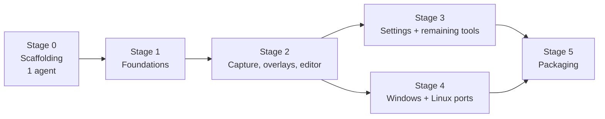

# Chartreuse build checklist

This is the build plan for [PLAN.md](PLAN.md). Milestone numbers such as (M3) refer to
PLAN.md's [Milestones](PLAN.md#milestones).

## How to read this file

- **Stages** run in order. Every stage has a gate: the next stage starts only after the
  stage it depends on is finished.
- **Sequential** sections are done by one agent, top to bottom.
- **Parallel** stages are split into **tracks** (for example `2A`). Each track is given to
  one agent. A track lists:
  - **Depends on:** tracks or tasks that must be merged before it starts.
  - **Owns:** the crates and modules it may change. Two tracks never own the same module.
    Anything outside a track's ownership goes through the owner, or waits for an
    integration task.
- **Integration** tasks connect finished tracks inside the app crate. They all edit
  `crates/chartreuse`, so run them one at a time, in any order, once their dependencies
  have landed.
- Every commit builds and passes tests, and follows Conventional Commits (see
  [AGENTS.md](AGENTS.md)). Agents rebase onto the latest main line before merging.

## Decisions

These are PLAN.md's open questions, plus choices that are needed before certain tasks can
start. Each decision is made by a human and recorded in PLAN.md. The tasks it blocks
cannot start until it is made.

- [x] Reverse-DNS namespace for the bundle identifiers. Blocks: 5A (release signing).
      Decided: `io.jennings` (`io.jennings.chartreuse`, `io.jennings.chartreuse.dev`).
- [x] Multiple captures: one editor at a time, or one editor window per capture? Blocks:
      I4 (editor integration). Decided: one editor window per capture.
- [x] Window capture source: crop from the frozen capture, capture the window directly, or
      offer a setting? Blocks: 2G window capture, I5. Decided: capture directly.
- [x] Window shadows and rounded corners: include them or not? Blocks: 2G window capture.
      Decided: include them.
- [x] Launch at login: in scope for v1? Blocks: 3C. Decided: yes.
- [x] Additional export targets: format choice (PNG/JPEG/WebP), copy file path, pinned
      floating capture. Blocks: 3D. Decided: format choice only.

## Stage 0 — Scaffolding (sequential, one agent)

The goal is a signed, launchable, blank app. It also fixes every cross-crate contract in
place, so that Stage 1 agents can work without editing each other's code.

- [x] Cargo workspace
  - [x] Root `Cargo.toml`: workspace members, shared `[workspace.dependencies]` (pin
        iced), `[workspace.lints]`, edition, `rust-toolchain.toml`
  - [x] Choose the macOS bindings (e.g. the `objc2` family) and add them as workspace
        dependencies, so that every macOS track uses the same bindings
  - [x] `.gitignore` for `target/`
  - [x] Create these crates as compiling stubs:
    - [x] `crates/chartreuse`: binary; iced daemon and app core
    - [x] `crates/chartreuse-core`: shared types and pure logic
    - [x] `crates/chartreuse-platform`: platform traits and per-OS backends
    - [x] `crates/chartreuse-imaging`: pixel operations, encode and decode
    - [x] `crates/chartreuse-config`: settings schema and persistence
    - [x] `crates/chartreuse-overlay`: selection overlay canvas programs
    - [x] `crates/chartreuse-editor`: document model, tools, editor canvas
    - [x] `xtask`: build automation, plus the `cargo xtask` alias in
          `.cargo/config.toml`
- [x] xtask (see [Build system](PLAN.md#build-system))
  - [x] `check`: `cargo fmt --check`, `cargo clippy -D warnings`, `cargo test`
  - [x] `bundle` (see [macOS code signing](PLAN.md#macos-code-signing)): assemble
        `target/debug/Chartreuse Dev.app` with an `Info.plist` containing
        `LSUIElement` and `LSMinimumSystemVersion` 14.0, plus a placeholder `.icns` built
        with `iconutil`
  - [x] Signing: `codesign` with the identity from an env var (e.g.
        `CHARTREUSE_SIGN_IDENTITY`) and hardened runtime. If no identity is set, sign
        ad-hoc and print a loud warning. Print the designated requirement, and warn if
        it contains a `cdhash`.
  - [x] `run`: `bundle`, then launch with `open`, with stdout and stderr sent to the
        terminal
  - [x] `release`: picks the steps for the host OS. On macOS it builds an optimized,
        release-flavor `Chartreuse.app` signed with the configured identity; 5A extends
        it to the full notarized disk image. Missing credentials fail with the name of
        the variable to set.
- [x] CI (GitHub Actions). Workflows contain no build logic: after checkout and
      installing the toolchain, every step is a `cargo xtask` command. Any new CI need
      becomes an xtask command first.
  - [x] macOS runner: `cargo xtask check` and `cargo xtask bundle` (ad-hoc signed)
  - [x] Ubuntu and Windows runners: `cargo xtask check`, to keep the `Unsupported`
        backends compiling until the ports land
  - [x] Manually triggered release workflow that runs `cargo xtask release` and uploads
        the output (credentials added in 5A)
- [x] Build flavor (`chartreuse-core::flavor`)
  - [x] Compile-time dev/release switch that is independent of the Cargo profile (a
        cargo feature or build-time env var that the xtask sets)
  - [x] Constants for the bundle identifier, display name, and accent color (`#f0cc00`
        for dev, `#80ff00` for release)
- [x] Shared types in `chartreuse-core` (real signatures, minimal bodies)
  - [x] Geometry: logical and physical points, sizes, and rects; scale factor
  - [x] `DisplayInfo`, `WindowInfo` (bounds, z-order, owner), `DisplayId`, `WindowId`
  - [x] `Image`: an RGBA8 buffer with its physical pixel size
  - [x] `Hotkey` (modifiers + key), `CaptureMode` (display / window / rectangle)
  - [x] Error type
- [x] Platform contracts in `chartreuse-platform`
  - [x] Traits: `Displays`, `Capture`, `WindowList`, `Hotkeys`, `StatusItem`,
        `Clipboard`, `FileDialogs`, `OverlayWindowStyle` (applied through the native
        window handle), `Permissions`
  - [x] `platform::current()` chooses the backend with `cfg`. Backends that are not
        implemented yet return `Error::Unsupported`, so every target compiles.
  - [x] Module layout: `macos/`, `windows/`, `linux/x11/`, `linux/wayland/`, with one
        file per trait, so parallel tracks don't touch the same files
  - [x] `fake` backend (synthetic displays, windows, and generated images) for tests
        and for UI work without real capture
- [x] App core skeleton in `crates/chartreuse`
  - [x] Start `iced::daemon` with zero windows plus one blank placeholder window, to
        prove that windows open and close
  - [x] A `Message` enum with a variant group for every planned source: hotkey, status
        item menu, capture result, overlay, editor, settings, import/export
  - [x] One handler module per feature (`hotkeys.rs`, `tray.rs`, `capture.rs`,
        `overlay.rs`, `editor.rs`, `settings.rs`, `import.rs`, `export.rs`), each
        starting empty, so integration work doesn't collide
  - [x] A window registry mapping each window id to its kind (overlay, editor, settings,
        alert)
  - [x] `report_error` user-notice path: a simple alert window that later tracks use for
        hotkey conflicts, an empty clipboard, decode failures, etc.
  - [x] A theme built from the flavor's accent color
  - [x] `tracing` logging to stderr
- [x] README: development setup (certificate, env var, `cargo xtask run`)
- [x] Verify
  - [x] `cargo xtask run` opens a blank window with the yellow accent and no Dock icon
  - [x] `cargo xtask release` produces a green-accent `Chartreuse.app`
  - [x] CI is green on all three runners

**Gate:** everything above is merged. From here on, agents work in parallel.

## Stage 1 — Foundations (parallel, up to 8 tracks)

All tracks depend only on Stage 0. Together, 1A, 1B, and 1C complete M1.

### 1A — Status item (macOS)

Owns: `chartreuse-platform/src/macos/status_item.rs`, `crates/chartreuse/src/tray.rs`

- [x] `NSStatusItem` with a placeholder template icon
- [x] Menu entries: Capture display, Capture window, Capture rectangle, Open from
      clipboard, Open from file, Settings, Quit
- [x] Deliver menu actions as a `Subscription`
- [x] `NSApplicationActivationPolicyAccessory` (no Dock presence)
- [x] Wire Quit and log the other actions

### 1B — Global hotkeys (macOS)

Owns: `chartreuse-platform/src/macos/hotkeys.rs`, `crates/chartreuse/src/hotkeys.rs`

- [x] Carbon `RegisterEventHotKey` / unregister behind the `Hotkeys` trait
- [x] Deliver hotkey events as a `Subscription`
- [x] Support re-registration with a new set of hotkeys (used later by settings)
- [x] Report registration failures through `report_error`
- [x] One hardcoded hotkey for M1 that logs when pressed

### 1C — Screen Recording permission (macOS)

Owns: `chartreuse-platform/src/macos/permissions.rs`, a permission module in the app crate

- [x] `CGPreflightScreenCaptureAccess` check at startup and before each capture
- [x] `CGRequestScreenCaptureAccess` on first run
- [x] A guidance window when permission is missing or revoked (with a link to System
      Settings)
- [x] Verify the first-run flow after `tccutil reset`

### 1D — Display model

Owns: `chartreuse-core::display`, `chartreuse-platform/src/macos/displays.rs`

- [x] Logical ↔ physical conversions for each display and for the global desktop space
- [x] Map a point or rect to the display(s) it lies on
- [x] Unit tests with mixed scale factors, negative origins, and layouts with gaps
- [x] macOS enumeration through `NSScreen` / `CGDisplay*`, with flipped-y handled

### 1E — Imaging

Owns: `chartreuse-imaging`

- [x] Crop and copy regions in physical pixels
- [x] Composite several per-display captures into one image (layout taken from the
      display model types)
- [x] Encode and decode PNG, JPEG, and other common formats; choose the crate here
- [x] Pixelate and blur kernels (used later by 3B)
- [x] Unit tests

### 1F — Config

Owns: `chartreuse-config`

- [ ] Settings schema: three hotkeys, save directory, filename pattern, post-capture
      behavior
- [ ] A hand-editable TOML file in the platform config directory, with the directory
      derived from the flavor's bundle identifier
- [ ] Defaults, a clear error for an invalid file, and forward-compatible unknown keys
- [ ] Expand filename patterns (date/time tokens) and resolve collisions
- [ ] Unit tests

### 1G — Editor document model (pure logic)

Owns: `chartreuse-editor::model`

- [x] `Document`: base image, an ordered list of annotations, and the selection
- [x] Annotation types for the M4 set (line, arrow, rectangle, text), extensible for 3B
- [x] Style: color, stroke width, font size
- [x] Command-based undo/redo that covers add, move, restyle, delete, and reorder
- [x] Hit-testing geometry for each annotation type
- [x] Unit tests

### 1H — Release assets workflow

Depends on: Stage 0. Owns: `.github/workflows/` release workflows and any xtask command
they need (for example an upload command). 5A, 5B, and 5C later extend what each
platform's `cargo xtask release` produces; this track makes sure it reaches users.

- [x] A workflow triggered when a GitHub release is **created** (`release: types:
      [created]`, not `published`)
- [x] A job per supported platform (macOS, Windows, Linux) that runs `cargo xtask release`
      for the release's tag, so every platform's release build comes from one source
- [x] Attach every platform's release output to the triggering release as downloadable
      assets, through an xtask command (e.g. `cargo xtask upload-release <tag>`) so the
      workflow keeps no logic of its own
- [x] Platforms whose release packaging isn't done yet still attach a usable build (e.g.
      an ad-hoc signed macOS app until 5A, a zipped binary for Windows and Linux until 5B
      and 5C), named so users can tell platform and architecture apart
- [x] Document cutting a release through GitHub in the README

**Gate:** Stage 1 tracks are merged as each finishes. Each Stage 2 track may start as
soon as its own dependencies have landed.

## Stage 2 — Capture, overlays, editor (parallel tracks, then integration)

### 2A — Display capture (macOS)

Depends on: 1C, 1D. Owns: `chartreuse-platform/src/macos/capture.rs`

- [x] `SCShareableContent` display enumeration, matched to the display model
- [x] `SCScreenshotManager` capture of every display at native resolution
- [x] Detect blank or wallpaper-only captures and send them to the 1C guidance flow

### 2B — Clipboard and file dialogs (macOS)

Depends on: Stage 0. Owns: `chartreuse-platform/src/macos/{clipboard,dialogs}.rs`

- [x] Write an image to `NSPasteboard` (PNG and TIFF representations)
- [x] Read an image from `NSPasteboard`, and tell the caller when there isn't one
- [x] `NSOpenPanel` limited to supported image formats
- [x] `NSSavePanel` with the default location and filename

### 2C — Overlay windows (macOS)

Depends on: 1D. Owns: `chartreuse-platform/src/macos/overlay_style.rs`, overlay window
setup in `chartreuse-overlay`

- [ ] One borderless iced window per display, placed using the display model
- [ ] Through the native handle: a window level above the menu bar and Dock, plus
      `canJoinAllSpaces` and `fullScreenAuxiliary`
- [ ] Verify above full-screen apps and on the active Space

### 2D — Rectangle selection canvas

Depends on: 1D. Owns: `chartreuse-overlay::rectangle`

- [x] `Canvas` program: frozen image, translucent dim, live selection box
- [x] State machine for press, drag, release, and Escape; emits commit or cancel
- [x] Selections that span displays, in global coordinates
- [x] Output scale for selections across mixed-scale displays: define it and test it
- [x] Development harness using the `fake` backend

### 2E — Editor canvas and M4 tools

Depends on: 1G. Owns: `chartreuse-editor::{canvas,tools}`, the editor window view

- [ ] Tool framework: a `Tool` trait and interaction state machine, with one module per
      tool. Land this first; the tools below can then be split among agents.
  - [ ] Line
  - [ ] Arrow
  - [ ] Rectangle
  - [ ] Text (cosmic-text rendering, in-place editing)
- [ ] Select, move, and delete annotations, with selection handles
- [ ] Keyboard shortcuts for undo/redo and delete
- [ ] Toolbar with style controls, using the accent color

### 2F — Flatten and export

Depends on: 1E, 1G. Owns: `chartreuse-editor::flatten`

- [ ] Render annotations to pixels so the result matches the canvas; choose the
      rasterizer here
- [ ] Rasterize text with the same fonts and shaping the canvas uses
- [ ] Golden-image tests for each annotation type

### 2G — Window enumeration and capture (macOS)

Depends on: 1D; the window capture decisions for the capture half. Owns:
`chartreuse-platform/src/macos/window_list.rs`, window capture in
`chartreuse-platform/src/macos/capture.rs` (coordinate with 2A)

- [x] Window list with bounds, z-order, and owner (`SCShareableContent`, plus
      `CGWindowListCopyWindowInfo` if needed), excluding Chartreuse's own windows
- [x] Find the topmost window at a global point
- [x] Single-window capture with `SCContentFilter`, following the decisions

### 2H — Window selection canvas

Depends on: 2D (shares its overlay patterns). Owns: `chartreuse-overlay::window`

- [ ] `Canvas` program that dims everything except the hovered window, with the
      highlight following the pointer
- [ ] Click commits and Escape cancels

### Integration (sequential, app crate)

- [x] I2 — Capture display (M2). Depends on: 1A, 1B, 2A, 2B, 1E.
  - [x] Hotkey and menu → capture all displays → composite
  - [x] Save to file and copy to the clipboard, with no editor yet
- [ ] I3 — Rectangle selection (M3). Depends on: I2, 2C, 2D.
  - [ ] Capture first, then open overlays on the frozen image
  - [ ] Commit → crop → hand the image off (clipboard until I4 lands)
- [ ] I4 — Editor (M4). Depends on: 2B, 2E, 2F, and the multiple-captures decision.
  - [ ] Open the editor from a capture, from the clipboard, or from a file (menu
        items); report an empty clipboard and undecodable files to the user
  - [ ] Save and copy export actions, each with an optional close-after
  - [ ] Send I2 and I3 results to the editor
- [ ] I5 — Window selection (M5). Depends on: I3, 2G, 2H, and the window-capture-source
      decision.

## Stage 3 — Settings and remaining editor tools (parallel)

### 3A — Settings (M6)

Depends on: 1B, 1F, I4. Owns: `crates/chartreuse/src/settings.rs`, the settings window

- [ ] Settings window, opened from the menu
- [ ] Hotkey recorder widget for each of the three hotkeys; re-register on change and
      report conflicts
- [ ] Save location picker and filename pattern with a preview
- [ ] Post-capture behavior (open the editor, or copy directly), applied in the capture
      flow
- [ ] Pick up changes made to the config file by hand (reload)

### 3B — Remaining editor tools (M7)

Depends on: 2E (tool framework), 2F. Every tool below is its own module and can run as a
separate parallel agent.

- [ ] Ellipse
- [ ] Freehand pen
- [ ] Highlighter
- [ ] Numbered step markers, with automatic numbering that stays correct when a marker
      is deleted
- [ ] Blur / pixelate region (uses the 1E kernels)
- [ ] Crop, undoable and non-destructive until export
- [ ] Restyling panel: color, stroke width, and font size for the selected annotation
- [ ] Flatten support and golden tests for each tool

### 3C — Launch at login

Depends on: the launch-at-login decision, 3A.

- [ ] macOS `SMAppService` toggle in settings
- [ ] Windows and Linux support added in 4A and 4B

### 3D — Additional export targets

Depends on: the export targets decision, I4.

- [ ] One task for each export target chosen in the decision

## Stage 4 — Ports (parallel)

Windows (4A) and Linux (4B) are independent of each other. Within each port, subsystem
tracks can run in parallel, because every trait lives in its own file. Each port ends
with one integration pass.

### 4A — Windows (M8)

Depends on: Stage 2 integration complete. Owns: `chartreuse-platform/src/windows/`

- [ ] Per-Monitor DPI Awareness v2 manifest; displays via `EnumDisplayMonitors` and
      `GetDpiForMonitor`
- [ ] Display capture with Windows.Graphics.Capture, falling back to DXGI or `BitBlt`
- [ ] Window enumeration using DWM extended frame bounds, skipping cloaked windows
- [ ] Window capture with WGC `CreateForWindow`, falling back to `PrintWindow`
- [ ] Overlay window style: `WS_EX_TOPMOST` and `WS_EX_TOOLWINDOW`
- [ ] `RegisterHotKey`
- [ ] `Shell_NotifyIcon` tray, with no taskbar entry
- [ ] Clipboard with `CF_DIBV5` and a registered PNG format
- [ ] `IFileOpenDialog` / `IFileSaveDialog`
- [ ] Launch at login using the `Run` key (if 3C is in scope)
- [ ] Integration pass: every M2–M7 flow works on Windows

### 4B — Linux (M9)

Depends on: Stage 2 integration complete. Owns: `chartreuse-platform/src/linux/`

- [ ] Shared between X11 and Wayland (parallel)
  - [ ] StatusNotifierItem tray over D-Bus
  - [ ] File dialogs through the FileChooser portal
  - [ ] Launch at login via XDG autostart (if 3C is in scope)
- [ ] X11 (parallel subsystems)
  - [ ] RandR displays
  - [ ] `XShmGetImage` capture
  - [ ] EWMH window list and XComposite window capture
  - [ ] Override-redirect overlays
  - [ ] `XGrabKey` hotkeys
  - [ ] `CLIPBOARD` selection
- [ ] Wayland (after X11 is working, per PLAN.md; subsystems in parallel)
  - [ ] Displays from `wl_output`, `xdg-output`, and fractional scale
  - [ ] Display capture through the Screenshot portal
  - [ ] Window capture through the interactive portal, or `ext-image-copy-capture`
        where available
  - [ ] `wlr-layer-shell` overlays, with a full-screen `xdg_toplevel` fallback
  - [ ] GlobalShortcuts portal
  - [ ] Clipboard with `wl_data_device`
- [ ] Integration pass for each backend
- [ ] Document the limitations of each compositor

### 4C — CLI entry point and single instance

Depends on: Stage 2 integration complete. Owns: an `ipc` module in the app crate and the
CLI argument parsing. It can run in parallel with 4A and 4B.

- [ ] Single-instance detection and an IPC channel to the running instance
- [ ] `chartreuse capture {display,window,rectangle}` and `chartreuse open <file>`
- [ ] Document binding a desktop shortcut to the CLI

## Stage 5 — Packaging (M10, parallel per platform)

Every packaging step is added to `cargo xtask release` for its platform. The CI release
workflow keeps running only `cargo xtask` commands.

### 5A — macOS release

Depends on: the bundle identifier decision, Stage 3. Owns: the macOS part of the
`release` xtask command, `cargo xtask ci-keychain`, and the macOS signing credentials in
the release workflows (1H owns the workflows themselves).

- [ ] Universal binary with `lipo` (`aarch64` + `x86_64`)
- [ ] Release `Info.plist` and entitlements file
- [ ] Developer ID signing with hardened runtime and a secure timestamp, signing nested
      code inside-out, without `--deep`
- [ ] Disk image built with `hdiutil`, then signed
- [ ] Notarization with `notarytool` (API key or keychain profile, from env vars), then
      stapling
- [ ] Verification with `codesign --verify --strict`, `spctl`, and `stapler validate`,
      run as part of `cargo xtask release`
- [ ] `cargo xtask ci-keychain`: temporary keychain, `.p12` import, key partition list;
      the release workflow calls it before `cargo xtask release` (`rcodesign` if
      keychain handling proves fragile)
- [ ] Document cutting a release from a developer machine with `cargo xtask release`

### 5B — Windows installer

Depends on: 4A.

- [ ] Installer (tool chosen in this track) built by `cargo xtask release` on Windows, with
      code signing if available; CI uploads the artifact

### 5C — Linux packages

Depends on: 4B.

- [ ] Flatpak manifest with portal permissions, built by `cargo xtask release` on Linux; CI
      uploads the artifact
- [ ] Further packages (e.g. `.deb`, AUR) as decided

### 5D — Artwork

Depends on: nothing; can be done at any time.

- [ ] App icon (`.icns`, `.ico`, PNG sizes)
- [ ] Status item template icon and tray icons
